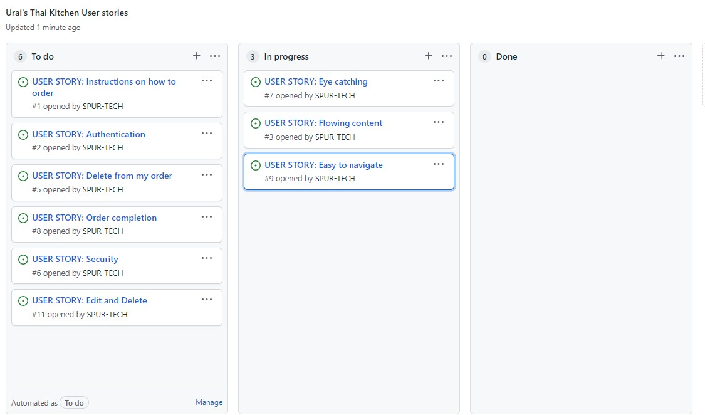

# Urai's Thai Kitchen

### Live site:

https://uriskitchen.herokuapp.com/

---

# Table of content:

- [Urai's Thai Kitchen](#urais-thai-kitchen)
    - [Welcome Reader,](#welcome-reader)
        - [Project target:](#project-target)
    - [Screen shots of the site and it's responsive abilities:](#screen-shots-of-the-site-and-its-responsive-abilities)
    - [User stories in an Agile methodology:](#user-stories-in-an-agile-methodology)
        - [This shows the structure of what went into the project:](#this-shows-the-structure-of-what-went-into-the-project)
- [UI/UX](#uiux)
- [Content Requirements:](#content-requirements)
    - [Wireframes, Created using https://balsamiq.com/wireframes/](#wireframes-created-using-httpsbalsamiqcomwireframes)
        - [Links to the other pages:](#links-to-the-other-pages)
    - [Organization:](#organization)
    - [features:](#features)
- [The landing page:](#the-landing-page)
- [The Meals page:](#the-meals-page)
    - [The Meals detail page:](#meal-detail-page)
    - [The Meals comment page:](#meal-comment-page)
    - [The Meals delete page:](#meal-delete-page)
- [The Desserts page:](#the-desserts-page)
- [The footer:](#the-footer)
- [The Account pages:](#the-account-pages)
- [Sign up page:](#sign-up-page)
- [Log in page:](#log-in-page)
- [Log out page:](#log-out-page)
    - [Existing features:](#existing-features)
    - [Features to be added in the future:](#features-to-be-added-in-the-future)
- [Testing:](#testing)
    - [Technologies stack:](#technologies-stack)
        - [Languages:](#languages)
        - [Additional Languages:](#additional-languages)
        - [Frameworks and Libraries:](#frameworks-and-libraries)
    - [See results below:](#see-results-below)
- [Bugs and fixes:](#bugs-and-fixes)
- [CREDITS:](#credits)
- [Deployment:](#deployment)
    - [Deploying on Heroku:](#deploying-on-heroku)

## Welcome Reader,

This is a description of this website and all it's workings which covers the main features and functions right through to bug fixes and deployment.

---

## Project target:

Urai,s Thai Kitchen is a thai food delivery service for the hungry folk that like Thai food and of course an easy to use eye catching website to obtain such joys.
In this site the user can create an account so the next order will be easier with a simple login.
It's also part of the Code Institute Fullstack Diploma Course and in this particular project using an Agile methodology I demonstrate the use of a database. Adding the menus via the admin section and summoning them back to the allocated pages with javascript. Saving the order in local storage and retrieving the order back and saving comments to the allocated meals or desserts to show my understanding of database usage.

I've given the user the ability to C.R.U.D. Create an order, Read back they,re order, Update it at any point until final purchase and of course Delete any items from that order until final purchase and leave a comment that can also be updated or deleted.

I've also added special role based authentication via Admin to a staff user to gain full access the Admin section which again brings the C.R.U.D. functionality to life.

- [Back to the top](#urais-thai-kitchen)

---

##  Screen shots of the site and it's responsive abilities:

I used http://ami.responsivedesign.is/ to check what it would look like on all devices.
As you can see it's fully responsive right across all devices and adapts to any screen sizes.

- [Back to the top](#urais-thai-kitchen)

---

## User stories in an Agile methodology to construct the site and all it's functionality:

### This shows the structure of what went into the project:

- [Back to the top](#urais-thai-kitchen)

---

# UI/UX

 - As a first time user I would like a site that is eye catching and easy to use.

 - As a first time user I would like a site that is easy to use and quick to order food.

 - As a first time user I would like instructions to order food.

 - As a first time user 0r existing I would like know that my details will secure.

 - As a returning user I would like to login with my username and password so I don't need to keep putting in my details.

 - As a site user I would like complete control of my order if I need to remove or add any items.

 - As a site user I would like to be notified on how long it will take to deliver.

 - As a site user I would like a confirmation email of my order.

 - As a site user I would like to leave a comment on meals or desserts that I enjoyed.

 - As a site user I would like to be able to edit or delete a comment I've made.

 - As the site owner I would like like to add or delete items in the menus and update anything that requires it.

 - As a staff member I would like special access to the admin page so I can Create, Read, Update and Delete menu items and/or user details.

 ### All of the above user stories were met except receiving an email as we have only learnt how to attach our own email address not users. As my skills build this will surly be added in the future.

- [Back to the top](#urais-thai-kitchen)

 ---

 # Content Requirements:
    
- The UI/UX **must** address these:

    - Easy site navigation.
    - An easy to read menu of both meals and desserts.
    - A clear description of each meal or dessert.
    - Easy food ordering process.
    - Clear order info for next order.
    - Easy sign up, Log in and Log out system.
    - A user must not be able to edit or delete anyone else's comments.

- The UI/UX **should** address these:
    
    - Instructions on how to order if user is new to the page.
    - Send an email of order confirmation.
    - Leave a comment.
    

- [Back to the top](#urais-thai-kitchen)

---

## Wireframes, Created using https://balsamiq.com/wireframes/

The wire frames for the pages showcasing the bare structure of the site.

### Links to the other pages:
- [Meals Page](static/media/images/urais-kitchen-meals-wireframe.jpg)
- [Dessert Page](static/media/images/urais-kitchen-desserts-wireframe.jpg)
- [Cart Page](static/media/images/urais-kitchen-cart-wireframe.jpg)
- [Account Pages](static/media/images/urais-kitchen-account-pages-wireframe.jpg)

- [Back to the top](#urais-thai-kitchen)

----

## Organization:

All files are appropriately named with no capitalization or spaces and all in corresponding folders.
Each page has its own css and javascript for ease of maintenance.

- [Back to the top](#urais-thai-kitchen)

---

## features:

# The landing page:

I've gone for a posh restaurant look to stand out from the basic white background and black writing for a better User Experience with a nice background that flows thro8gh all pages.

The Title is to represent the sign that would be on the front of the building and the instructions how to order is on a slate place mat written in bright bold colors that compliment each other well and stand out clearly.

The restaurants phone number and opening times clearly displayed to the user.

All fonts were used from https://fonts.google.com/ and they were Red Hat Display, sans-serif, Beau Rivage, cursive.

- [Back to the top](#urais-thai-kitchen)

---

### The NAVBAR is seen on all pages for ease of use.

---

### The image below is of the collapsed NAVBAR as shown on smaller screens.

1. The NAVBAR has a black background which highlights the links and logo well. Linking to Home page, Meal page, Dessert page, Sign up page, log in page and Cart page. I've made the sign up, log in and cart always visible for better UI/UX.
2. The logo also links to the home page.
3. When hovered over the font brightens.
4. The active property brightens the font depending on what page is selected.
5. The NAVBAR is responsive to all screen sizes and collapses down to reveal a drop down section button.
6. The cart will show items added or deleted then will reset after completed order.
7. If user is logged in (log out) will replace sign up and log in.
8. The three lines on the right will open the dropdown menu on smaller screens.
 
 - [Back to the top](#urais-thai-kitchen)

 ---

# The Meals page:

1. The meals menu was created in the Admin section then formatted by Javascript and summoned to the relevant pages via HTML and styled in the CSS file with each page having it's own J.S and CSS file for ease of maintenance and bug fixing.
2. The images were stored in Cloudinary as Django dose not save media files.
3. The orders on the right is again on a slate background to tie in with the home page and the restaurant feel.
4. If user is signed in the then you can proceed to the cart with the button at the bottom otherwise the user is prompted to sign up or log in.
5. If the user clicks the cart at the top they will again be prompted to sign up or log in to complete the order.

- [Back to the top](#urais-thai-kitchen)

---

# Meal detail page:

## Shows all comments left in this particular meal. 

 - [Back to the top](#urais-thai-kitchen)

---

# Meal comment page:

## When the user clicks the comment button on meal detail page.
## When the user clicks the edit button the edit page is identical giving the user the ability to edit their previous comments.

 - [Back to the top](#urais-thai-kitchen)

---

# Meal delete page:

## When the user clicks the delete button on meal detail page.
- The delete the comment button will delete and redirect to menu.

## The user then has the option to delete or cancel deletion.
- The cancel button will just redirect to menu.

- [Back to the top](#urais-thai-kitchen)

---

# The Desserts page:

- The desserts page is much the same as the meals page in layout and responsiveness and the comments, edit and delete functions. 
- Here you can see the authentication buttons in the orders section that take the user to the relevant account page.

- [Back to the top](#urais-thai-kitchen)

---

# The footer:

1. The footer is shown in all pages for a nice flow.
2. My copyright tag is shown at the bottom with a bold pop to stand out.
3. All fully responsive.

- [Back to the top](#urais-thai-kitchen)

---

# The Account pages:

## All pages designed to flow with each other.

# Sign up page:

1. The Sign up page has Username that cant match existing Usernames.
2. Email address. (optional).
3. Password.
4. Confirm Password.
5. Bank details section but only a demo as I think that will be in the next Project.
6. Delivery address.
7. The user will be prompted for any errors in the form

- [Back to the top](#urais-thai-kitchen)

---

# Log in page:

1. Username.
2. Password.
3. Again the user will be prompted for any errors in the form

# Log out page:

## Just asks if the user is sure they want to sign out

- [Back to the top](#urais-thai-kitchen)

---

## Existing features:

- consistent NAVBAR on all pages for ease of use.
- flowing background image and styling.
- flowing typography on all pages.
- Clear instructions to ordering.
- consistent footer on all pages.
- Authentication system to complete order.
    - Sign up page to insert personal details.
    - Log in page for quick access on returning users .
    - Log out page to exit from site.
    - Leave, Edit or Delete a comment.
- Authentication system to gain access to admin panel.
    - Log in as admin or staff member to gain access to Admin panel.

- [Back to the top](#urais-thai-kitchen)

---

## Features to be added in the future:

- Email confirmation to user.
- Save order details if user wants to access an existing order.
- Add nutritional values to description details.
- Genuine payment method for real functioning site.

- [Back to the top](#urais-thai-kitchen)

---

# Testing:

- I have manually tested every part of the functionality every step of the way.
- Each time I write a new line of HTML, CSS OR JAVASCRIPT I check to see if it looks how I expect it to look.
- With the HTML and CSS I targeted certain classes by adding a solid color background to be sure I'm targeting the right section then continue with the styling.
- With the JAVASCRIPT I write a small piece of code then console log the result to make sure the result is as I expected before continuing.
- I then tested the functionality of said code for instance if it's a button then that button must send the correct data and redirect the user to the relevant page.
- I made sure that if the user is authenticated then the log out will display in the NAVBAR and the relevant buttons are shown in the cart.
- I made sure that all buttons to delete item and any other buttons are removed in the success page.
- I deployed the site early so I could physically check the media query has been coded correctly to have the responsive ability required.
- I then ask friends and family to use the site with no instruction to see from a different perspective and ideas from real people for bug hunting and improvements.
- Tests were made to ensure the role based user could add, delete or update the menus, users  and comments in the admin page successfully.
- Tests were also made to ensure the user could add, delete or update their comments successfully and not access any other comments made by others.
- I tested the responsiveness through all screen sizes.
- I then tested the site on Safari, Firefox and Chrome to make sure all was working correctly.

- Testing sites accessability on https://wave.webaim.org/

- No errors found.

- [Back to the top](#urais-thai-kitchen)

---

## Technologies stack:

### Languages:
- [HTML5](https://en.wikipedia.org/wiki/HTML5 "Link to HTML Wiki")
- [CSS3](https://en.wikipedia.org/wiki/Cascading_Style_Sheets "Link to CSS Wiki")

### Additional Languages:
- [Python](https://en.wikipedia.org/wiki/Python_(programming_language) "Link to Python Wiki")
     - Used for the main functionality of the whole build.

     ### Frameworks and Libraries:
- [Django](https://www.djangoproject.com/ "Link to Django Project website")
    - Django was used for the build of this project.
- [Cloudinary](https://cloudinary.com/ "Link to Cloudinary page")
     - Cloudinary was used for storing the images.
- [Bootstrap](https://getbootstrap.com/docs/5.0/getting-started/introduction/ "Link to Bootstrap page")
     - Bootstrap was used to create quick responsive behavior directly in the HTML.
- [Font Awesome](https://fontawesome.com/ "Link to FontAwesome")
     - Font Awesome was used shopping cart.
- [Google Fonts](https://fonts.google.com/ "Link to Google Fonts")
    - Google fonts were used for the fonts.
- [Git](https://git-scm.com/ "Link to Git homepage")
     - Git was used for to commit to Git and push to GitHub and Heroku.
- [GitHub](https://github.com/ "Link to GitHub")
     - GitHub was used to store the project.
- [Wave](https://wave.webaim.org/ "Link to Wave Homepage")
     - Wave was used to check the accessibility of the site.
- [Am I Responsive?](http://ami.responsivedesign.is/ "Link to Am I Responsive Homepage")
     - Am I Responsive was used to check if the site was fully responsive on all devices.
- [Web development tools](https://en.wikipedia.org/wiki/Web_development_tools "Link to Web development tools Wiki")
     - The developer tools were used a lot to check the styling, the console logs and the lighthouse results.

## See results below:

- [Back to the top](#urais-thai-kitchen)

---

# Bugs and fixes:

## *As this was my first time using Django there were many bugs and fixes:*

- ## **BUG**... 
    - I struggled to connect the models, views and urls.
- ## **FIX**... 
    - I contacted tutor support for some assistance for this and we fixed this issues I was having and explained to me where I was going wrong so now I can confidently add or remove models if need be.
- ## **BUG**... 
    - My background needed an overlay to soften the image but it covered everything on the page.
- ## **FIX**... 
    - I created a separate div in the HTML just for the background image then applied the overlay.
- ## **BUG**... 
    - Images would not show on live site.
- ## **FIX**... 
    - Again a visit to tutor support and in this case they were also baffled so they added a more direct link in the settings.py file which seemed to have fixed the issue.
- ## **BUG**... 
    - My menu background needed adjusting each time I changed the size of the screen or added an item.
- ## **FIX**... 
    - I moved the class I was calling in CSS into the next div and recreated the way the background was set using the solid background system mentioned in the testing stage then styled once the correct behavior was achieved now items can be added and the background will just expand to suite.
- ## **BUG**... 
    - I wanted to clear the cart when order was successful but it also cleared the order on the success page.
- ## **FIX**... 
    - I set a time delay on the clearing of the cart so that it sent the order to success page before it cleared.
- ## **BUG**... 
    - If the user leaves the success page the order is lost.
- ## **FIX**... 
    - I've added a message to say the order confirmation was sent via Email but of course i'ts just a message as the material learnt so far I can only receive an Email not send to the user. This something that can be amended in the future once I've learned this technique.
- ## **BUG**... 
    - Again the images didn't show on live site.
- ## **FIX**... 
    - If only all bugs were this simple... I just set debug to False in settings.py.
- ## **BUG**... 
    - Previously working JAVASCRIPT now throws errors.
- ## **FIX**... 
    - I realized that I needed to separate the JAVASCRIPT to link to i'ts own page I.E cart JAVASCRIPT to cart page e.t.c.
- ## **BUG**... 
    - Issue with Posting to database.
- ## **FIX**... 
    - Researched the 'POST' method on Stack overflow and came across Ajax function this seemed to fix the issue.
    - ## **BUG**... 
    - Issue comment,edit and delete function.
- ## **FIX**... 
    - I sort the help of **David Callaghan** from the Slack group  who helped me set a pk: to id the comments, the edits and deleting capability.
     - ## **BUG**... 
    - The user could edit or delete anyone's comment.
- ## **FIX**...
    - I sort the help of **Thanh Skustad** from the Slack group and we attached the comment to the comment writer and hide the edit and delete buttons if not comment writer.
---

- [Back to the top](#urais-thai-kitchen)

# CREDITS:

- ## A MASSIVE thank you to **Thanh Skustad** for helping me get around the issue of attaching a comment to the comment writer and hiding the edit and delete buttons if not comment writer.
- ## A special thank you to **Daniel Callaghan** for helping me get around the issue of clearing the cart but keeping the success page and linking comments and editing capabilities.
- ## Also my mentor **Jack_Mentor** for advancing my abilities in the Git terminal.
- ## And the Slack guys and all family and fiends for taking the time to review my site.

---

- Code Institute and tutor support.
- Cloudinary.
- Pexels.
- Font Awesome.
- Google Fonts.
- GitHub.
- Wave.
- Am I Responsive?
- Web development tools.

- [Back to the top](#urais-thai-kitchen)

---

# Deployment:

This project was developed Visual Studio Code usingGitPod workspace. The code was committed to Git and pushed to GitHub in the terminal.

## Deploying on Heroku:
To deploy this page to Heroku from its GitHub repository, the following steps were taken:

1. Create the Heroku App:
    - Select "Create new app" in Heroku.
    - Choose a name for your app and location.

2. Attach the Postgres database:
    - In the Resources tab, under add-ons, type in Postgres and select the Heroku Postgres option.

3. Prepare the environment and settings.py file:
    - In the Settings tab, click on Reveal Config Vars and copy the url next to DATABASE_URL.
    - In your GitPod workspace, create an env.py file in the main directory. 
    - Add the DATABASE_URL value and your chosen SECRET_KEY value to the env.py file.
    - Add the SECRET_KEY value to the Config Vars in Heroku.
    - Update the settings.py file to import the env file and add the SECRETKEY and DATABASE_URL file paths.
    - Update the Config Vars with the Cloudinary url, adding into the settings.py file also.
    - In settings.py add the following sections:
        - Cloudinary
        - cloudinary_storage
        - allauth
        - allauth.account
        - allauth.socialaccount
        - STATICFILE_STORAGE
        - STATICFILES_DIRS
        - STATIC_ROOT
        - MEDIA_URL
        - DEFAULT_FILE_STORAGE
        - TEMPLATES_DIR
        - Update DIRS in TEMPLATES with TEMPLATES_DIR
        - Update ALLOWED_HOSTS with ['app_name.heroku.com', 'localhost']
        - Ensure that DEBUG is set t False

4. Store Static and Media files in Cloudinary and Deploy to Heroku:
    - Create a file named "Procfile" in the main directory and add the following:
        - web: gunicorn project-name.WSGI
    - Log in to Heroku using the terminal Heroku login -i.
    - Then run the following command: **heroku git:remote -a your_app_name_here** and replace your_app_name_here with the name of your Heroku app. This will link the app to your Gitpod terminal.
    - After linking your app to your workspace, you can then deploy new versions of the app by running the command **git push heroku main** enter your app name and Heroku API Key when prompted and your app will be deployed to Heroku.
    - Then go to Heroku and click on your new app and then click open app. 

    - [Back to the top](#urais-thai-kitchen)
